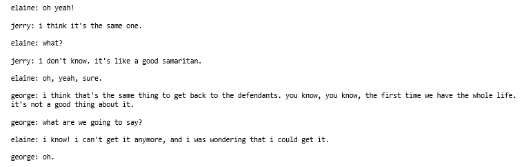

# TV-Script-Generation-with-RNN

This project generates a TV script from scratch using RNNs. 

The model is trained on a part of the Seinfeld's dataset of TV scripts from 9 seasons (1989-1998).

The Neural Network generate a new,"fake" TV script, based on patterns it recognizes in this training data.

The RNN network uses word embeddings and LSTM layers.

The length of the output script can be customized to the desired size.

## Installation

The training dataset is provided in the "data" directory . Details about Seinfeld dataset are provided in the notebook.
`./data/Seinfeld_Scripts.txt`

Download the repository and run the notebook to train the model and generate your own TV scripts.

## How to use

Once the model is trained, choose the desired length of the output (I used 400 words) and provide to the network the character's name starting the script ("George"...) or any other character existing in the vocabulary.

Set `gen_length`

Set `prime_word`

then run the model:

`generated_script = generate(trained_rnn, vocab_to_int[prime_word + ':'], int_to_vocab, token_dict, vocab_to_int[pad_word], gen_length)`

## Content

The notebook follows the following structure:
- Get and pre-process the data
- Build the Neural Network
  - Prepare the input and Dataloader
  - Build the model
  - Define forward and backpropagation
- Train the model
- Generate new TV scripts

## RNN hyperparameters

All hyperparameters can be self tuned.

I used 2 LSTM layers with hidden size of 1024 and an embedding dimension of 512.

The model was trained with 5 epochs, a batch size of 512 and a sequence length of 8 words (word sequence for the LSTM to predict the next word).

Some randomness is used to predict next word by randomly picking out one of the top 5 predictions.

## Results

Excerpt of a generated script:

